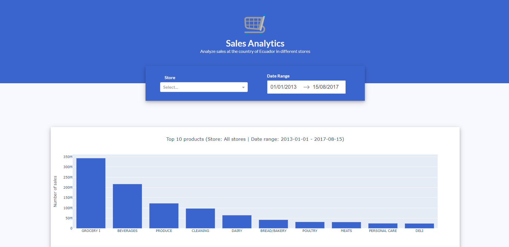
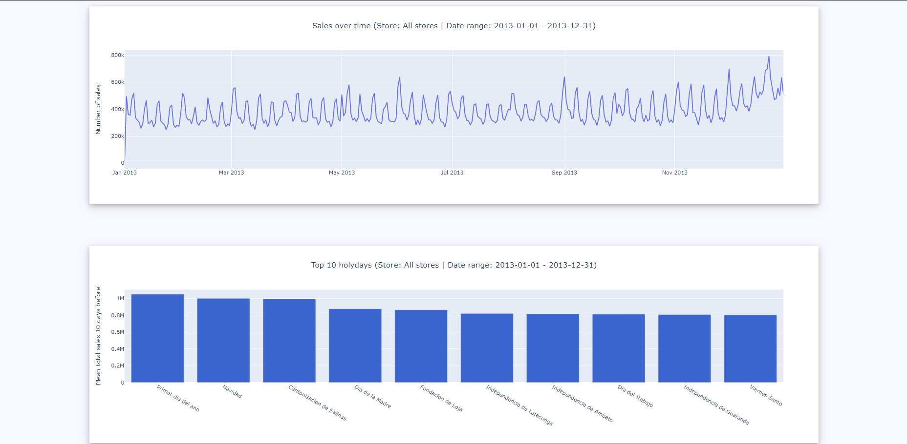
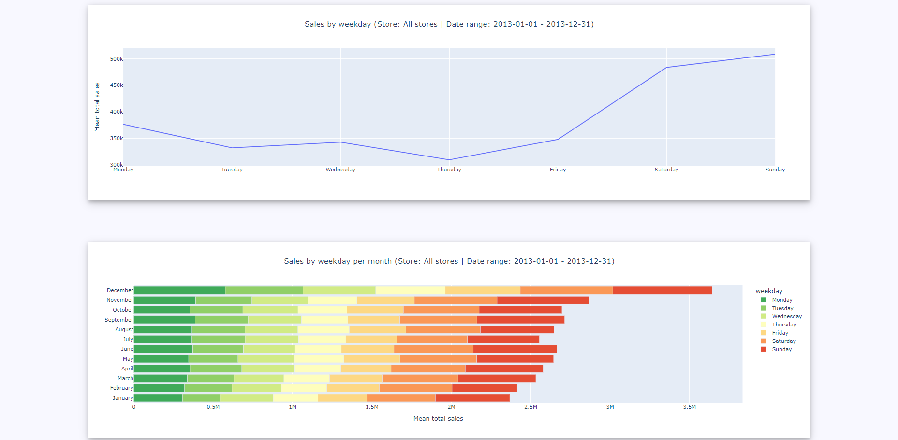

# Sales Dashboard

Interactive Sales Dashboard using [Dash](https://dash.plotly.com) for visualization.

</img>
</img>
</img>

&nbsp;

# Setting Up

## 1. [Optional] Create a enviroment

With conda

    conda create --name sales-dashboard python=3.10.8
    y
    conda activate sales-dashboard

With venv

    py -m venv venv

    # On linux
    ./venv/Scripts/activate

    # On Windows
    cd venv/Scripts
    activate

## 2. Install the requirements using pip

    pip install -r requirements.txt

## 3. Download dataset

Since "sales.csv" is too big to be uploaded on GiHub you can download it [here](https://www.kaggle.com/competitions/store-sales-time-series-forecasting/data). It's the "train.csv", just rename it

&nbsp;

# Running

To view the dashboard from the Dash server, simply execute "dashboard.py"

The app will start at http://127.0.0.1:8050

&nbsp;

#  Repository description

    ├─── images --> (images used in README.md)
    ├─── assets --> (style for Dash)
    ├─── data --> (csv files directory)
    │    ├─── holidays_events.csv --> (Holidays data)
    │    ├─── oil.csv --> (Price of oil in some dates)
    │    ├─── sales.csv --> (Sales data)
    │    └─── stores.csv --> (Stores data)
    ├─── processing.py --> (Functions to process data)
    ├─── charts.py --> (Chart generation functions)
    └─── dashboard.py --> (Main file that starts the dashboard)

&nbsp;

# Credits

## All rights reserved to João Vitor Oliveira de Melo ([JhonesBR][myGit] on github)

[myGit]: <https://github.com/JhonesBR>